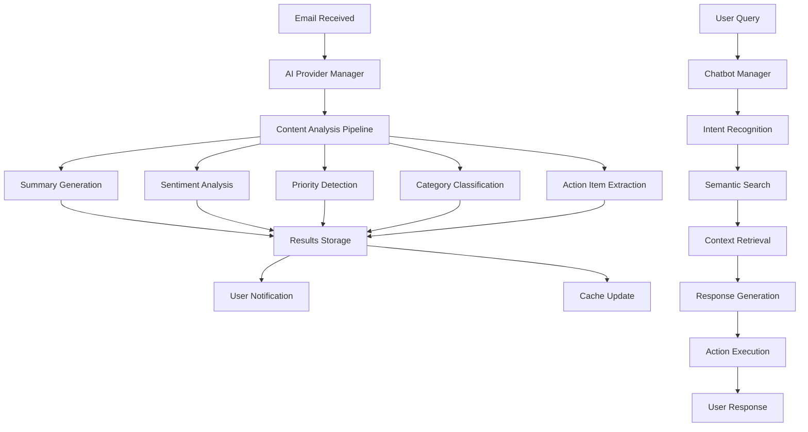

# MailPilot AI - AI Integration Documentation

## Overview

MailPilot AI leverages Google Gemini and advanced AI technologies to provide intelligent email management capabilities. This document details the AI integration architecture, implemented features, and API integration based on the actual codebase implementation.

## AI Architecture

### Technology Stack

- **Primary AI Provider**: Google Gemini Pro/Flash
- **Provider Management**: Multi-provider architecture supporting Gemini, Claude, and custom providers
- **Vector Database**: pgvector (PostgreSQL extension)
- **Embeddings**: Google Embedding Models for semantic search
- **Authentication**: Google Cloud API keys with secure token management
- **Rate Limiting**: Per-user quotas with intelligent throttling
- **Caching**: Multi-level caching for performance optimization

### AI Processing Pipeline



### Provider Architecture

The system uses a provider-based architecture supporting multiple AI services:

````typescript
interface AIProviderManager {
  // Provider registration and management
  registerProvider(providerId: string, provider: AIProvider): void;
  setDefaultProvider(providerId: string): void;
  getProvider(providerId?: string): AIProvider;

  // AI operations
  summarizeEmail(request: EmailSummaryRequest, providerId?: string): Promise<AIResponse>;
  composeEmail(request: EmailComposeRequest, providerId?: string): Promise<AIResponse>;
  analyzeEmail(emailContent: string, providerId?: string): Promise<EmailAnalysis>;
}

## Core AI Features

### 1. Email Summarization

**API Endpoint**: `POST /api/ai/summarize`

**Purpose**: Generate intelligent, context-aware summaries of email content with configurable options

**Implementation Details**:

```typescript
interface EmailSummaryRequest {
  emailId: string;
  options?: {
    includeActionItems?: boolean;
    includeSentiment?: boolean;
    includeKeyPoints?: boolean;
    includeCategory?: boolean;
    language?: string;
    summaryLength?: "short" | "medium" | "long";
  };
}

interface EmailSummaryResponse {
  summary: {
    id: string;
    emailId: string;
    summary: string;
    keyPoints: string[];
    sentiment: {
      overall: "neutral" | "positive" | "negative" | "urgent";
      score: number;
      confidence: number;
    };
    priority: {
      level: "low" | "medium" | "high" | "critical";
      score: number;
      confidence: number;
      reasons: string[];
    };
    category: {
      primary: string;
      secondary?: string;
      confidence: number;
    };
    actionItems: Array<{
      text: string;
      priority: "low" | "medium" | "high";
      dueDate?: string;
    }>;
    entities: Array<{
      type: "date" | "person" | "organization" | "location";
      value: string;
      normalized?: string;
    }>;
    confidenceScore: number;
    processingTime: number;
    createdAt: string;
  };
}
````

**Gemini Prompt Engineering**:

```typescript
const SUMMARY_PROMPT = `
You are an intelligent email assistant analyzing email content for professional users.

Email Content:
Subject: {subject}
From: {from}
To: {to}
Body: {body}

User Context:
- Language: {language}
- Summary Style: {style}
- User Role: {user_role}
- Company Domain: {domain}

Please analyze and provide:
1. Concise summary (max {max_length} words)
2. Key points (3-5 bullet points)
3. Sentiment analysis (positive/negative/neutral/urgent)
4. Priority level (low/medium/high/critical) with reasoning
5. Primary category (work/personal/newsletter/etc.)
6. Action items with due dates if mentioned
7. Named entities (people, dates, organizations)

Respond in JSON format with high confidence scores.
`;
```

### 2. Batch Email Analysis

**API Endpoint**: `POST /api/ai/batch-analyze`

**Purpose**: Efficiently process multiple emails with comprehensive analysis

**Features**:

- Parallel processing with rate limiting
- Configurable analysis types
- Progress tracking
- Error handling and partial results

```typescript
interface BatchAnalysisRequest {
  emailIds: string[];
  analysisTypes: (
    | "summary"
    | "sentiment"
    | "priority"
    | "category"
    | "actionItems"
  )[];
  options?: {
    maxConcurrent?: number;
    timeout?: number;
    continueOnError?: boolean;
  };
}

interface BatchAnalysisResponse {
  results: Array<{
    emailId: string;
    success: boolean;
    analysis?: EmailAnalysis;
    error?: string;
  }>;
  statistics: {
    processed: number;
    successful: number;
    failed: number;
    totalProcessingTime: number;
    averageProcessingTime: number;
  };
}
```

### 3. Smart Reply Generation

**API Endpoint**: `POST /api/ai/reply-suggestions`

**Purpose**: Generate contextually appropriate email replies with multiple options

**Advanced Features**:

- Thread context awareness
- Tone adaptation based on sender relationship
- Template matching and suggestions
- Multi-language support
- Follow-up recommendations

```typescript
interface ReplyGenerationRequest {
  emailId: string;
  tone?: "professional" | "casual" | "friendly" | "formal";
  length?: "short" | "medium" | "long";
  intent?: "accept" | "decline" | "request_info" | "acknowledge" | "custom";
  context?: string;
  includeQuote?: boolean;
  language?: string;
}

interface ReplyGenerationResponse {
  suggestions: Array<{
    id: string;
    subject: string;
    body: {
      text: string;
      html: string;
    };
    tone: string;
    confidence: number;
    reasoning: string;
    templateUsed?: string;
  }>;
  templates: Array<{
    name: string;
    content: string;
    applicability: number;
  }>;
  originalEmail: {
    subject: string;
    summary: string;
    keyPoints: string[];
  };
}
```

### 4. AI-Powered Email Composition

**API Endpoint**: `POST /api/ai/compose`

**Purpose**: Generate complete emails from natural language prompts

**Implementation**:

```typescript
interface EmailCompositionRequest {
  prompt: string;
  recipient?: string;
  tone?: "professional" | "casual" | "friendly" | "formal";
  length?: "short" | "medium" | "long";
  purpose?: "inquiry" | "update" | "request" | "follow-up" | "introduction";
  context?: string;
  includeSignature?: boolean;
}

interface EmailCompositionResponse {
  composition: {
    subject: string;
    body: {
      text: string;
      html: string;
    };
    tone: string;
    confidence: number;
    suggestions: string[];
    improvements: Array<{
      type: "clarity" | "tone" | "structure" | "grammar";
      suggestion: string;
    }>;
  };
}
```

### 5. Advanced Email Categorization

**API Endpoint**: `POST /api/ai/categorize`

**Purpose**: Intelligent email organization with custom categories and auto-labeling

**Features**:

- Default category recognition
- Custom user-defined categories
- Confidence scoring
- Folder suggestions
- Auto-labeling based on rules

```typescript
interface CategorizationRequest {
  emailIds: string[];
  customCategories?: string[];
  usePersonalModel?: boolean;
  confidenceThreshold?: number;
}

interface CategorizationResponse {
  results: Array<{
    emailId: string;
    category: {
      primary: string;
      secondary?: string;
      confidence: number;
    };
    suggestedFolder: string;
    suggestedLabels: string[];
    reasoning: string;
  }>;
}
```

**Default Categories**:

- **Work/Business**: Project updates, meetings, corporate communications
- **Personal**: Family, friends, personal matters
- **Financial**: Bills, banking, investments, receipts
- **Travel**: Bookings, itineraries, confirmations
- **Shopping**: Orders, receipts, promotions
- **Health**: Medical appointments, health records
- **Education**: Courses, certifications, learning materials
- **Social**: Social media notifications, events
- **Newsletter**: Subscriptions, updates, news
- **Support**: Customer service, technical support

### 6. Priority Detection & Scoring

**API Endpoint**: `POST /api/ai/priority`

**Purpose**: Automatically detect email importance with detailed reasoning

**Priority Factors**:

- **Sender Authority**: Executive, manager, client, VIP contacts
- **Content Keywords**: Urgent, deadline, ASAP, important, critical
- **Temporal Indicators**: Time-sensitive content, deadlines, meetings
- **User Interaction History**: Response patterns, engagement levels
- **Context Analysis**: Project relevance, task dependencies

```typescript
interface PriorityDetectionRequest {
  emailIds: string[];
  userContext?: {
    role?: string;
    department?: string;
    projects?: string[];
    vipContacts?: string[];
  };
}

interface PriorityDetectionResponse {
  results: Array<{
    emailId: string;
    priority: {
      level: "low" | "medium" | "high" | "critical";
      score: number; // 0-1
      confidence: number; // 0-1
      factors: {
        senderImportance: number;
        keywordMatches: string[];
        contentUrgency: number;
        temporalFactors: number;
        userHistory: number;
      };
      reasons: string[];
      recommendedActions: string[];
    };
  }>;
}
```

## Chatbot Integration

### Intelligent Email Assistant

**API Endpoint**: `POST /api/chat`

**Purpose**: Natural language interface for email management with context-aware responses and action execution

**Architecture**:

```typescript
interface ChatbotRequest {
  message: string;
  context?: {
    currentFolder?: string;
    selectedEmails?: string[];
    previousMessages?: ChatMessage[];
    userPreferences?: UserPreferences;
  };
  sessionId?: string;
  responseFormat?: "text" | "structured" | "actionable";
}

interface ChatbotResponse {
  response: {
    id: string;
    message: string;
    type: "text" | "structured" | "actionable";
    actionTaken?: string;
    data?: any;
    responseTime: number;
    suggestions: Array<{
      text: string;
      action: string;
      parameters?: Record<string, any>;
    }>;
    confidence: number;
    timestamp: string;
  };
  session: {
    id: string;
    messageCount: number;
    startedAt: string;
  };
}
```

### Intent Recognition & Processing

**Supported Intent Categories**:

#### 1. Email Search & Discovery

```
Examples:
- "Show me emails about the project deadline"
- "Find unread emails from my boss this week"
- "What emails mention the Q4 budget?"
- "Search for emails with attachments from last month"
```

**Intent Processing**:

```typescript
interface EmailSearchIntent {
  type: "email_search";
  entities: {
    keywords?: string[];
    senders?: string[];
    recipients?: string[];
    dateRange?: {
      start?: string;
      end?: string;
      relative?: "today" | "week" | "month";
    };
    folders?: string[];
    attributes?: ("unread" | "starred" | "hasAttachments")[];
  };
  filters: SearchFilters;
}
```

#### 2. Email Actions & Management

```
Examples:
- "Mark all emails from newsletter@company.com as read"
- "Archive old promotional emails"
- "Star emails from my manager this week"
- "Move emails about 'project alpha' to the work folder"
```

**Action Processing**:

```typescript
interface EmailActionIntent {
  type: "email_action";
  action: "mark_read" | "archive" | "star" | "move" | "delete" | "snooze";
  targets: {
    emailIds?: string[];
    criteria?: SearchCriteria;
  };
  parameters: {
    folderId?: string;
    snoozeUntil?: string;
    bulkConfirm?: boolean;
  };
}
```

#### 3. Analytics & Insights

```
Examples:
- "How many emails did I receive this month?"
- "Who are my top 5 email contacts?"
- "Show me my email response time trends"
- "What's my average emails per day?"
```

**Analytics Processing**:

```typescript
interface AnalyticsIntent {
  type: "analytics";
  metric: "count" | "trends" | "contacts" | "response_time" | "categories";
  timeframe: {
    period: "day" | "week" | "month" | "quarter" | "year";
    relative?: boolean;
  };
  groupBy?: "sender" | "folder" | "category" | "time";
}
```

### Conversation Context Management

**Context Tracking**:

```typescript
interface ConversationContext {
  sessionId: string;
  userId: string;
  messages: ChatMessage[];
  currentState: {
    activeFolder?: string;
    selectedEmails?: string[];
    lastAction?: string;
    pendingConfirmations?: PendingAction[];
  };
  userPreferences: {
    preferredResponseFormat: "brief" | "detailed";
    defaultTimeframe: "week" | "month";
    confirmBulkActions: boolean;
  };
  metadata: {
    startedAt: string;
    lastActivity: string;
    messageCount: number;
  };
}
```

### Advanced Chatbot Features

#### 1. Multi-Turn Conversations

```typescript
// Example conversation flow
User: "Show me important emails from this week";
Bot: "I found 12 important emails this week. Would you like me to summarize them?";
User: "Yes, and also check if any have deadlines";
Bot: "Here are the summaries, and I found 3 emails with upcoming deadlines...";
```

#### 2. Proactive Suggestions

```typescript
interface ProactiveSuggestion {
  type: "suggestion";
  category: "optimization" | "cleanup" | "priority" | "followup";
  message: string;
  actions: Array<{
    text: string;
    action: string;
    impact: "low" | "medium" | "high";
  }>;
  reasoning: string;
}
```

#### 3. Action Confirmation & Execution

```typescript
// Bulk action with confirmation
User: "Archive all promotional emails older than 3 months"
Bot: "I found 127 promotional emails older than 3 months. This action will:"
- Archive 127 emails
- Free up approximately 15MB of storage
- Move them to the Archive folder
"Would you like me to proceed?"

User: "Yes, proceed"
Bot: "Completed! Archived 127 emails successfully."
```

### Semantic Search Engine

**Vector-Based Search Implementation**:

```typescript
interface SemanticSearch {
  // Generate embeddings for query
  generateQueryEmbedding(query: string): Promise<number[]>;

  // Find similar emails using vector similarity
  findSimilarEmails(
    embedding: number[],
    filters?: SearchFilters,
    limit?: number
  ): Promise<SimilarityResult[]>;

  // Hybrid search combining semantic and keyword
  hybridSearch(
    query: string,
    options: {
      semanticWeight?: number; // 0-1
      keywordWeight?: number; // 0-1
      filters?: SearchFilters;
    }
  ): Promise<SearchResult[]>;
}
```

**Search Result Ranking**:

```typescript
interface SearchResult {
  email: EmailSummary;
  relevanceScore: number;
  matchReasons: Array<{
    type: "semantic" | "keyword" | "metadata";
    score: number;
    matches: string[];
  }>;
  highlights: string[];
}
```

### Chatbot API Integration Examples

#### Real-time Email Search

```typescript
// User query: "Find emails about quarterly review meeting"
const response = await chatbot.processQuery({
  message: "Find emails about quarterly review meeting",
  userId: userId,
  context: {
    currentFolder: "inbox",
  },
});

// Execute semantic search
if (response.actionTaken === "semantic_search") {
  const searchResults = await emailService.semanticSearch({
    query: "quarterly review meeting",
    userId: userId,
    filters: response.searchParams,
    limit: 10,
  });

  return {
    message: `Found ${searchResults.length} emails about quarterly review meetings`,
    data: searchResults,
    suggestions: [
      "Show me just the meeting invites",
      "Summarize the key points",
      "When is the next review scheduled?",
    ],
  };
}
```

#### Bulk Email Operations

```typescript
// User query: "Archive all newsletters from last month"
const response = await chatbot.processQuery({
  message: "Archive all newsletters from last month",
  userId: userId,
});

if (response.actionTaken === "bulk_archive") {
  // Find matching emails
  const emails = await emailService.search({
    category: "newsletter",
    dateRange: {
      start: moment().subtract(1, "month").startOf("month").toISOString(),
      end: moment().subtract(1, "month").endOf("month").toISOString(),
    },
    userId: userId,
  });

  // Request confirmation for bulk action
  if (emails.length > 10) {
    return {
      message: `Found ${emails.length} newsletter emails from last month. Confirm archive?`,
      data: { emailCount: emails.length, preview: emails.slice(0, 5) },
      suggestions: [
        { text: "Yes, archive all", action: "confirm_bulk_archive" },
        { text: "Show me first", action: "preview_emails" },
        { text: "Cancel", action: "cancel_action" },
      ],
    };
  }

  // Execute bulk archive
  await emailService.bulkArchive(emails.map((e) => e.id));

  return {
    message: `Successfully archived ${emails.length} newsletter emails`,
    suggestions: [
      "Undo last action",
      "Show archive folder",
      "Clean up more emails",
    ],
  };
}
```

### Feedback & Learning System

**Feedback Collection**:

```typescript
interface ChatbotFeedback {
  interactionId: string;
  userId: string;
  rating: 1 | 2 | 3 | 4 | 5;
  feedback?: string;
  categories: Array<"helpful" | "accurate" | "fast" | "relevant">;
  improvements?: string;
  timestamp: string;
}
```

**Continuous Learning**:

- User interaction patterns
- Success/failure rates for actions
- Query refinement based on feedback
- Personalized response adaptation

## Reply Suggestions

### Smart Reply Generation

**Purpose**: Generate contextually appropriate email replies

**Features**:

- Multiple tone options (professional, casual, friendly)
- Context-aware responses
- Template suggestions
- Follow-up recommendations

**Implementation**:

```typescript
interface ReplyRequest {
  emailId: string;
  tone: "professional" | "casual" | "friendly" | "formal";
  length: "short" | "medium" | "long";
  intent: "accept" | "decline" | "request_info" | "acknowledge" | "custom";
  context?: string;
}

interface ReplyResponse {
  suggestions: {
    subject: string;
    body: string;
    tone: string;
    confidence: number;
  }[];
  templates: {
    name: string;
    content: string;
  }[];
}
```

### Template System

**Common Templates**:

- Meeting acceptance/decline
- Information requests
- Follow-up messages
- Thank you notes
- Scheduling requests

## Auto-Reply System

### Rule-Based Automation

**Purpose**: Automatically respond to emails based on user-defined rules

**Rule Types**:

```typescript
interface AutoReplyRule {
  id: string;
  name: string;
  conditions: {
    senderEmail?: string[];
    subjectContains?: string[];
    bodyContains?: string[];
    timeRange?: TimeRange;
    priority?: string;
  };
  actions: {
    reply?: {
      template: string;
      delay?: number; // minutes
    };
    forward?: {
      to: string[];
      template?: string;
    };
    categorize?: string;
    priority?: string;
  };
  enabled: boolean;
}
```

## Vector Database Integration

### Email Embeddings

**Purpose**: Enable semantic search across email content

**Implementation**:

```sql
-- Add vector column to emails table
ALTER TABLE email ADD COLUMN content_embedding vector(1536);

-- Create vector index
CREATE INDEX ON email USING ivfflat (content_embedding vector_cosine_ops)
WITH (lists = 100);
```

**Embedding Generation**:

```typescript
interface EmbeddingService {
  generateEmbedding(text: string): Promise<number[]>;
  findSimilar(embedding: number[], limit: number): Promise<SimilarityResult[]>;
  updateEmailEmbedding(emailId: string, content: string): Promise<void>;
}
```

### Semantic Search Queries

**Example Searches**:

```typescript
// Find emails similar to: "project deadline discussion"
const query = "project deadline discussion";
const embedding = await embeddingService.generateEmbedding(query);
const results = await embeddingService.findSimilar(embedding, 10);

// Search with filters
const results = await searchEmails({
  query: "meeting next week",
  filters: {
    dateRange: { start: "2024-01-01", end: "2024-01-31" },
    sender: "boss@company.com",
    hasAttachments: true,
  },
  semanticSearch: true,
});
```

## AI Performance Optimization

### Caching Strategy

**Multi-Level Caching Architecture**:

```typescript
interface AICache {
  // Level 1: In-memory cache for frequent operations
  memoryCache: {
    getSummary(emailId: string): EmailSummary | null;
    setSummary(emailId: string, summary: EmailSummary, ttl?: number): void;
    getEmbedding(contentHash: string): number[] | null;
    setEmbedding(contentHash: string, embedding: number[]): void;
    invalidate(pattern: string): void;
    getStats(): CacheStats;
  };

  // Level 2: Redis cache for shared and persistent data
  redisCache: {
    getUserPreferences(userId: string): Promise<AIPreferences | null>;
    setUserPreferences(userId: string, prefs: AIPreferences): Promise<void>;
    getRecentSummaries(userId: string, limit: number): Promise<EmailSummary[]>;
    getCachedReply(templateId: string, context: string): Promise<string | null>;
    setCachedReply(
      templateId: string,
      context: string,
      reply: string
    ): Promise<void>;
    invalidateUserCache(userId: string): Promise<void>;
  };

  // Level 3: Database cache for analyzed content
  databaseCache: {
    getAnalyzedEmail(emailId: string): Promise<EmailAnalysis | null>;
    setAnalyzedEmail(emailId: string, analysis: EmailAnalysis): Promise<void>;
    getTemplateUsage(templateId: string): Promise<TemplateUsageStats>;
    updateTemplateUsage(templateId: string, usage: UsageUpdate): Promise<void>;
  };
}
```

**Cache Invalidation Strategy**:

```typescript
interface CacheInvalidation {
  // Time-based expiration
  ttlStrategies: {
    email_summaries: "24h";
    reply_suggestions: "1h";
    user_preferences: "7d";
    embeddings: "30d";
    analytics: "6h";
  };

  // Event-based invalidation
  invalidateOnEvents: {
    user_settings_change: string[]; // Cache keys to invalidate
    email_updated: string[];
    provider_config_change: string[];
  };

  // Smart cache warming
  warmCache(userId: string, priorities: CachePriority[]): Promise<void>;

  // Cache hit/miss analytics
  getCacheMetrics(): Promise<{
    hitRate: number;
    missRate: number;
    avgResponseTime: number;
    memoryUsage: number;
    redisConnections: number;
  }>;
}
```

### Batch Processing System

**Purpose**: Process multiple emails efficiently with optimized resource utilization

```typescript
interface BatchProcessor {
  // Queue management
  addToBatch(
    emailIds: string[],
    operation: "summarize" | "categorize" | "analyze" | "embed",
    priority: "low" | "medium" | "high" | "urgent"
  ): Promise<BatchJobId>;

  // Parallel processing with resource management
  processBatch(
    batchId: BatchJobId,
    options: {
      maxConcurrency: number; // 5 default
      retryFailedItems: boolean; // true default
      progressCallback?: (progress: BatchProgress) => void;
      timeoutMs?: number; // 300000 default (5 min)
    }
  ): Promise<BatchResult>;

  // Smart batching based on content similarity
  createOptimalBatches(
    emails: EmailEntity[],
    operation: BatchOperation
  ): Promise<
    Array<{
      batchId: string;
      emailIds: string[];
      estimatedProcessingTime: number;
      resourceRequirements: ResourceRequirements;
    }>
  >;
}
```

**Batch Optimization Logic**:

```typescript
interface BatchOptimization {
  // Group similar content for efficient processing
  groupByContentSimilarity(
    emails: EmailEntity[],
    threshold: number // 0.8 default
  ): Promise<EmailGroup[]>;

  // Optimize processing order
  optimizeProcessingOrder(
    batches: BatchJob[],
    availableResources: SystemResources
  ): Promise<OptimizedSchedule>;

  // Resource allocation
  allocateResources(
    jobs: BatchJob[],
    constraints: {
      maxMemoryMb: number;
      maxConcurrentRequests: number;
      priorityWeights: Record<Priority, number>;
    }
  ): Promise<ResourceAllocation>;
}
```

### Rate Limiting & Quota Management

**Provider-Specific Rate Limits**:

```typescript
interface RateLimitConfig {
  gemini: {
    requestsPerMinute: 60;
    tokensPerMinute: 32000;
    requestsPerDay: 1500;
    burstLimit: 10; // Temporary burst allowance
  };

  openai: {
    requestsPerMinute: 500;
    tokensPerMinute: 160000;
    requestsPerDay: 10000;
    tierLimits: {
      tier1: { rpm: 500; tpm: 40000 };
      tier2: { rpm: 5000; tpm: 160000 };
    };
  };

  anthropic: {
    requestsPerMinute: 50;
    tokensPerMinute: 40000;
    requestsPerDay: 1000;
  };
}
```

**Smart Rate Limiting**:

```typescript
interface SmartRateLimiter {
  // Dynamic quota allocation
  allocateQuota(
    userId: string,
    operation: AIOperation,
    requestedQuota: number
  ): Promise<{
    allocated: number;
    waitTimeMs?: number;
    alternativeProvider?: string;
  }>;

  // Load balancing across providers
  selectOptimalProvider(
    operation: AIOperation,
    requirements: {
      quality: "high" | "medium" | "low";
      speed: "fast" | "medium" | "slow";
      cost: "low" | "medium" | "high";
    }
  ): Promise<{
    provider: string;
    estimatedWaitTime: number;
    estimatedCost: number;
    qualityScore: number;
  }>;

  // Queue management
  enqueueRequest(
    request: AIRequest,
    priority: RequestPriority
  ): Promise<{
    queuePosition: number;
    estimatedWaitTime: number;
    canUpgradePriority: boolean;
  }>;
}
```

### Performance Monitoring & Analytics

**Real-Time Metrics**:

```typescript
interface AIPerformanceMetrics {
  // Response time tracking
  responseTimeMetrics: {
    avg_response_time_ms: number;
    p95_response_time_ms: number;
    p99_response_time_ms: number;
    timeout_rate: number;
  };

  // Quality metrics
  qualityMetrics: {
    summarization_accuracy: number; // 0-1
    sentiment_accuracy: number; // 0-1
    category_accuracy: number; // 0-1
    user_satisfaction_rating: number; // 1-5
  };

  // Resource utilization
  resourceMetrics: {
    memory_usage_mb: number;
    cpu_utilization: number;
    api_quota_utilization: number;
    cache_hit_rate: number;
    queue_length: number;
  };

  // Provider performance
  providerMetrics: Record<
    string,
    {
      availability: number; // 0-1
      avg_response_time: number;
      error_rate: number;
      cost_per_request: number;
      quality_score: number;
    }
  >;
}
```

**Performance Optimization Strategies**:

```typescript
interface OptimizationStrategies {
  // Auto-scaling based on demand
  autoScale(
    currentMetrics: AIPerformanceMetrics,
    thresholds: ScalingThresholds
  ): Promise<{
    action: "scale_up" | "scale_down" | "maintain";
    newCapacity: number;
    estimatedCost: number;
  }>;

  // Model selection optimization
  optimizeModelSelection(
    task: AITask,
    constraints: {
      maxLatency: number;
      maxCost: number;
      minQuality: number;
    }
  ): Promise<{
    recommendedModel: string;
    expectedLatency: number;
    expectedCost: number;
    expectedQuality: number;
  }>;

  // Prompt optimization
  optimizePrompts(
    taskType: "summarization" | "categorization" | "reply_generation",
    performanceHistory: PromptPerformance[]
  ): Promise<{
    optimizedPrompt: string;
    expectedImprovement: number;
    testingPlan: string;
  }>;
}
```

## Prompt Engineering

### Strategic Prompt Design

**Context-Aware Prompt Templates**:

```typescript
interface PromptTemplate {
  id: string;
  name: string;
  taskType:
    | "summarization"
    | "categorization"
    | "reply_generation"
    | "sentiment_analysis";
  template: string;
  variables: Array<{
    name: string;
    type: "string" | "number" | "object";
    required: boolean;
    description: string;
  }>;
  version: string;
  performanceMetrics: {
    accuracy: number;
    avgResponseTime: number;
    userSatisfaction: number;
  };
}

const promptTemplates: PromptTemplate[] = [
  {
    id: "email-summarization-v3",
    name: "Professional Email Summarization",
    taskType: "summarization",
    template: `You are an intelligent email assistant for MailPilot AI. Your role is to help users manage their emails efficiently by providing accurate, concise summaries.

Context:
- User: {{user_name}} ({{user_role}})
- Email from: {{sender_name}} <{{sender_email}}>
- Email subject: "{{subject}}"
- Email type: {{email_type}}
- User preferences: {{preferences}}
- Previous interaction context: {{context_history}}

Email Content:
{{email_content}}

Instructions:
1. Create a concise summary ({{max_length}} words max)
2. Identify key action items with due dates
3. Determine sentiment and urgency level
4. Extract important dates, names, and numbers
5. Suggest appropriate response actions

Output format (JSON):
{
  "summary": "Brief overview of email content",
  "keyPoints": ["point1", "point2", "point3"],
  "actionItems": [
    {
      "task": "description",
      "dueDate": "YYYY-MM-DD or null",
      "priority": "high|medium|low"
    }
  ],
  "sentiment": "positive|negative|neutral",
  "urgency": "high|medium|low",
  "suggestedActions": ["reply", "schedule", "archive"],
  "entities": {
    "people": ["name1", "name2"],
    "dates": ["2024-01-15", "next Friday"],
    "numbers": ["$1000", "15%"],
    "locations": ["New York", "Conference Room A"]
  },
  "confidence": 0.95
}`,
    variables: [
      {
        name: "user_name",
        type: "string",
        required: true,
        description: "User's full name",
      },
      {
        name: "user_role",
        type: "string",
        required: false,
        description: "User's job title/role",
      },
      {
        name: "sender_name",
        type: "string",
        required: true,
        description: "Email sender's name",
      },
      {
        name: "sender_email",
        type: "string",
        required: true,
        description: "Email sender's address",
      },
      {
        name: "subject",
        type: "string",
        required: true,
        description: "Email subject line",
      },
      {
        name: "email_type",
        type: "string",
        required: false,
        description: "Categorized email type",
      },
      {
        name: "preferences",
        type: "object",
        required: false,
        description: "User's AI preferences",
      },
      {
        name: "context_history",
        type: "string",
        required: false,
        description: "Previous conversation context",
      },
      {
        name: "email_content",
        type: "string",
        required: true,
        description: "Full email body content",
      },
      {
        name: "max_length",
        type: "number",
        required: false,
        description: "Maximum summary length in words",
      },
    ],
    version: "3.1",
    performanceMetrics: {
      accuracy: 0.92,
      avgResponseTime: 2800,
      userSatisfaction: 4.3,
    },
  },
];
```

### Advanced Prompt Techniques

#### 1. Chain-of-Thought Prompting

```typescript
interface ChainOfThoughtPrompt {
  // Multi-step reasoning for complex email analysis
  template: string;
  steps: Array<{
    instruction: string;
    expected_output: string;
    validation_criteria: string;
  }>;

  example: `
Step 1: Analyze the email structure and identify main sections
Step 2: Extract factual information (dates, names, numbers, locations)  
Step 3: Determine the sender's intent and primary request
Step 4: Assess urgency based on language indicators and deadlines
Step 5: Generate summary incorporating all findings
`;
}
```

#### 2. Few-Shot Learning Examples

```typescript
interface FewShotPrompting {
  examples: Array<{
    input: string;
    expected_output: string;
    explanation: string;
  }>;

  // Email categorization examples
  categorizationExamples: [
    {
      input: "Subject: Project Alpha - Deadline Update\nBody: Hi team, we need to push back the project deadline by one week due to resource constraints...";
      expected_output: `{"category": "work", "subcategory": "project_update", "priority": "high"}`;
      explanation: "Work-related project communication with timeline impact";
    },
    {
      input: "Subject: 25% Off Everything - Limited Time!\nBody: Don't miss out on our biggest sale of the year. Use code SAVE25...";
      expected_output: `{"category": "promotional", "subcategory": "discount_offer", "priority": "low"}`;
      explanation: "Commercial promotional email with discount offer";
    }
  ];
}
```

#### 3. Role-Based Persona Prompting

```typescript
interface PersonaPrompt {
  persona: {
    role: "professional_assistant" | "technical_expert" | "casual_friend";
    traits: string[];
    communication_style: string;
    expertise_areas: string[];
  };

  professional_assistant: {
    role: "professional_assistant";
    traits: ["helpful", "precise", "courteous", "efficient"];
    communication_style: "formal yet approachable";
    expertise_areas: [
      "business communication",
      "meeting scheduling",
      "task management"
    ];
  };
}
```

### Prompt Optimization & Testing

**A/B Testing Framework**:

```typescript
interface PromptTesting {
  // Create prompt variants for testing
  createVariants(
    basePrompt: string,
    modifications: Array<{
      type: "style" | "structure" | "examples" | "instructions";
      change: string;
      hypothesis: string;
    }>
  ): Promise<PromptVariant[]>;

  // Run A/B tests
  runABTest(
    variants: PromptVariant[],
    testSet: EmailTestCase[],
    metrics: Array<"accuracy" | "response_time" | "user_preference">
  ): Promise<TestResults>;

  // Performance analysis
  analyzeResults(testResults: TestResults[]): Promise<{
    winningVariant: PromptVariant;
    improvementPercentage: number;
    statisticalSignificance: number;
    recommendations: string[];
  }>;
}
```

**Continuous Optimization**:

```typescript
interface PromptEvolution {
  // Feedback-driven improvements
  incorporateFeedback(
    promptId: string,
    userFeedback: Array<{
      rating: number;
      comments?: string;
      expectedOutput?: string;
      actualOutput: string;
    }>
  ): Promise<PromptImprovementSuggestions>;

  // Automated prompt refinement
  refinePrompt(
    currentPrompt: string,
    performanceData: PromptPerformanceData,
    targetImprovements: string[]
  ): Promise<{
    refinedPrompt: string;
    changes: string[];
    expectedImpact: number;
  }>;

  // Version control for prompts
  versionControl: {
    saveVersion(prompt: PromptTemplate): Promise<void>;
    rollback(promptId: string, version: string): Promise<void>;
    compareVersions(v1: string, v2: string): Promise<VersionComparison>;
  };
}
```

### Error Handling & Fallback Strategies

**Robust Error Management**:

```typescript
interface PromptErrorHandling {
  // Handle malformed AI responses
  validateResponse(
    response: string,
    expectedFormat: "json" | "text" | "structured"
  ): {
    isValid: boolean;
    errors: string[];
    cleanedResponse?: string;
  };

  // Fallback prompt strategies
  fallbackPrompts: {
    simplified: string; // Simpler version for complex emails
    generic: string; // Basic fallback when specific prompts fail
    errorRecovery: string; // Prompt for handling parsing errors
  };

  // Progressive prompt degradation
  degradePrompt(
    originalPrompt: string,
    errorType: "timeout" | "parse_error" | "token_limit",
    attempt: number
  ): Promise<{
    degradedPrompt: string;
    expectedQuality: number;
    recommendedAction: string;
  }>;
}
```

**Context Preservation**:

```typescript
interface ContextManagement {
  // Manage context within token limits
  optimizeContext(
    context: ConversationContext,
    tokenLimit: number,
    priorityRules: ContextPriorityRules
  ): Promise<OptimizedContext>;

  // Smart context truncation
  truncateContext(
    fullContext: string,
    maxTokens: number,
    preserveRules: {
      preserveRecent: boolean;
      preserveImportant: boolean;
      preserveActionItems: boolean;
    }
  ): Promise<{
    truncatedContext: string;
    tokensUsed: number;
    informationLost: string[];
  }>;

  // Context relevance scoring
  scoreContextRelevance(
    contextItems: ContextItem[],
    currentQuery: string
  ): Promise<
    Array<{
      item: ContextItem;
      relevanceScore: number;
      includeInPrompt: boolean;
    }>
  >;
}
```

## Privacy and Security

### Data Protection

**Email Content Handling**:

- Emails processed on-demand, not stored in AI service
- Sensitive data masking for PII
- User consent for AI processing
- Data retention policies

**API Security**:

```typescript
interface AISecurityConfig {
  encryptApiKeys: boolean;
  maskPersonalInfo: boolean;
  auditAllRequests: boolean;
  rateLimitPerUser: number;
  allowedDomains: string[];
}
```

### Compliance

**GDPR Compliance**:

- Right to data deletion
- Processing consent management
- Data export capabilities
- Audit trail maintenance

**Data Minimization**:

- Only process necessary content
- Remove processed data after analysis
- User control over AI features

## Monitoring and Analytics

### AI Performance Metrics

**Key Metrics**:

```typescript
interface AIMetrics {
  summarizationAccuracy: number;
  sentimentAccuracy: number;
  responseTime: number;
  userSatisfaction: number;
  apiUsage: number;
  errorRate: number;
}
```

**Monitoring Dashboard**:

- Real-time processing metrics
- User satisfaction scores
- API quota utilization
- Error tracking and alerting

### A/B Testing

**Feature Testing**:

- Prompt variations
- Model comparisons
- UI/UX improvements
- Response format testing

```typescript
interface ABTest {
  name: string;
  variants: {
    control: AIConfig;
    treatment: AIConfig;
  };
  metrics: string[];
  sampleSize: number;
  duration: number;
}
```

## Future Enhancements

### Planned Features

#### 1. Advanced Analytics

- Email pattern recognition
- Productivity insights
- Communication trend analysis
- Relationship mapping

#### 2. Multi-Modal Processing

- Image/document analysis
- Voice message transcription
- Calendar integration
- Task automation

#### 3. Personalization

- User-specific models
- Learning from feedback
- Custom categories
- Behavior prediction

#### 4. Integration Expansion

- CRM integration
- Project management tools
- Calendar applications
- Note-taking apps

### Research Areas

- Few-shot learning for user preferences
- Federated learning for privacy
- Real-time email processing
- Advanced NLP techniques

## API Integration Examples

### Email Summary Generation

```typescript
// Generate summary for new email
const summary = await aiService.generateSummary({
  emailId: "email-uuid",
  userId: "user-uuid",
  options: {
    includeKeyPoints: true,
    maxLength: 150,
    language: "en",
  },
});

// Store result
await db.insert(aiEmailSummary).values({
  emailId: summary.emailId,
  userId: summary.userId,
  summary: summary.text,
  keyPoints: summary.keyPoints,
  confidenceScore: summary.confidence,
});
```

### Chatbot Interaction

```typescript
// Process user query
const response = await chatbot.processQuery({
  message: "Show me urgent emails from this week",
  userId: userId,
  context: {
    currentFolder: "inbox",
  },
});

// Execute actions
if (response.actions.includes("email_search")) {
  const emails = await emailService.search({
    query: response.searchParams,
    userId: userId,
  });

  return {
    message: response.message,
    data: emails,
    suggestions: response.suggestions,
  };
}
```

This comprehensive AI integration provides the foundation for intelligent email management while maintaining user privacy and system performance.
