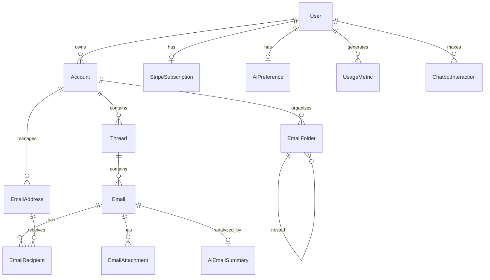

# Database Schema Documentation

## Overview

MailPilot AI uses PostgreSQL with Drizzle ORM for type-safe database operations. The schema is designed for scalability, performance, and multi-tenancy support.

## Database Architecture

### Technology Stack

- **Database**: PostgreSQL 15+
- **ORM**: Drizzle ORM with TypeScript
- **Hosting**: Supabase PostgreSQL
- **Migrations**: Drizzle Kit
- **Connection Pooling**: Supabase built-in pooling

### Design Principles

1. **Multi-tenancy**: All data is isolated by user/account
2. **Referential Integrity**: Foreign keys with cascade deletes
3. **Audit Trails**: Created/updated timestamps on all tables
4. **Performance**: Comprehensive indexing strategy
5. **Flexibility**: JSON fields for extensible metadata

## Core Schema Overview



## Table Definitions

### User Management

#### `user` - Core User Profiles

```sql
CREATE TABLE "user" (
  id UUID PRIMARY KEY DEFAULT gen_random_uuid(),
  email_address VARCHAR(255) NOT NULL UNIQUE,
  first_name VARCHAR(255),
  last_name VARCHAR(255),
  image_url TEXT,
  stripe_subscription_id TEXT UNIQUE,
  role TEXT DEFAULT 'user',
  is_active BOOLEAN DEFAULT true,
  email_verified BOOLEAN DEFAULT false,
  last_login_at TIMESTAMP,
  created_at TIMESTAMP DEFAULT now() NOT NULL,
  updated_at TIMESTAMP DEFAULT now() NOT NULL
);
```

**Purpose**: Central user registry with authentication and profile data.

**Key Features**:

- Unique email addresses for authentication
- Role-based access control
- Account status tracking
- Audit trail for logins

**Relationships**:

- One-to-many: Accounts, Usage Metrics, Chatbot Interactions
- One-to-one: Stripe Subscription, AI Preferences

#### `account` - Email Account Connections

```sql
CREATE TABLE account (
  id UUID PRIMARY KEY DEFAULT gen_random_uuid(),
  user_id UUID NOT NULL REFERENCES "user"(id) ON DELETE CASCADE,
  email_address VARCHAR(255) NOT NULL,
  provider VARCHAR(255) NOT NULL,
  provider_account_id TEXT,
  token VARCHAR(255) UNIQUE,
  refresh_token TEXT,
  token_expires_at TIMESTAMP,
  name VARCHAR(255),
  sync_status TEXT DEFAULT 'active',
  last_sync_at TIMESTAMP,
  is_active BOOLEAN DEFAULT true,
  binary_index JSON,
  next_delta_token TEXT,
  created_at TIMESTAMP DEFAULT now() NOT NULL,
  updated_at TIMESTAMP DEFAULT now() NOT NULL
);
```

**Purpose**: Manages connected email accounts (Gmail, Outlook, etc.) with OAuth tokens.

**Key Features**:

- Multi-provider support (Gmail, Outlook, IMAP)
- OAuth token management with refresh capabilities
- Sync status tracking
- Delta sync tokens for incremental updates

### Email Data

#### `thread` - Email Conversation Threads

```sql
CREATE TABLE thread (
  id UUID PRIMARY KEY DEFAULT gen_random_uuid(),
  account_id UUID NOT NULL REFERENCES account(id) ON DELETE CASCADE,
  subject TEXT NOT NULL,
  last_message_date TIMESTAMP NOT NULL,
  message_count INTEGER DEFAULT 0,
  participant_ids JSON NOT NULL DEFAULT '[]',
  done BOOLEAN DEFAULT false,
  inbox_status BOOLEAN DEFAULT true,
  draft_status BOOLEAN DEFAULT false,
  sent_status BOOLEAN DEFAULT false,
  is_starred BOOLEAN DEFAULT false,
  is_important BOOLEAN DEFAULT false,
  is_archived BOOLEAN DEFAULT false,
  is_spam BOOLEAN DEFAULT false,
  is_deleted BOOLEAN DEFAULT false,
  created_at TIMESTAMP DEFAULT now() NOT NULL,
  updated_at TIMESTAMP DEFAULT now() NOT NULL
);
```

**Purpose**: Groups related emails into conversation threads.

**Key Features**:

- Conversation grouping and management
- Multiple status flags for organization
- Participant tracking
- Message count for performance

#### `email` - Individual Email Messages

```sql
CREATE TABLE email (
  id UUID PRIMARY KEY DEFAULT gen_random_uuid(),
  thread_id UUID NOT NULL REFERENCES thread(id) ON DELETE CASCADE,
  from_id UUID NOT NULL REFERENCES email_address(id),
  subject TEXT,
  body TEXT,
  body_snippet TEXT,
  internet_message_id TEXT NOT NULL UNIQUE,
  sent_at TIMESTAMP,
  received_at TIMESTAMP,
  created_time TIMESTAMP NOT NULL,
  last_modified_time TIMESTAMP NOT NULL,
  sys_labels JSON NOT NULL DEFAULT '[]',
  keywords JSON NOT NULL DEFAULT '[]',
  sys_classifications JSON NOT NULL DEFAULT '[]',
  internet_headers JSON NOT NULL DEFAULT '{}',
  has_attachments BOOLEAN DEFAULT false,
  is_read BOOLEAN DEFAULT false,
  is_starred BOOLEAN DEFAULT false,
  is_important BOOLEAN DEFAULT false,
  is_draft BOOLEAN DEFAULT false,
  email_label TEXT DEFAULT 'inbox',
  size INTEGER,
  sensitivity TEXT DEFAULT 'normal',
  folder_id TEXT,
  created_at TIMESTAMP DEFAULT now() NOT NULL,
  updated_at TIMESTAMP DEFAULT now() NOT NULL
);
```

**Purpose**: Stores individual email messages with full content and metadata.

**Key Features**:

- Full email content and headers
- Multiple status flags (read, starred, important)
- Email size tracking
- Rich metadata storage in JSON fields
- Unique message ID for deduplication

#### `email_address` - Contact Management

```sql
CREATE TABLE email_address (
  id UUID PRIMARY KEY DEFAULT gen_random_uuid(),
  account_id UUID NOT NULL REFERENCES account(id) ON DELETE CASCADE,
  name TEXT,
  address VARCHAR(255) NOT NULL,
  raw TEXT,
  is_verified BOOLEAN DEFAULT false,
  created_at TIMESTAMP DEFAULT now() NOT NULL,
  updated_at TIMESTAMP DEFAULT now() NOT NULL
);
```

**Purpose**: Manages email addresses and contact information.

**Key Features**:

- Contact name resolution
- Address verification status
- Raw email header storage

#### `email_recipient` - Recipient Relationships

```sql
CREATE TABLE email_recipient (
  id UUID PRIMARY KEY DEFAULT gen_random_uuid(),
  email_id UUID NOT NULL REFERENCES email(id) ON DELETE CASCADE,
  email_address_id UUID NOT NULL REFERENCES email_address(id),
  recipient_type TEXT NOT NULL, -- 'to', 'cc', 'bcc'
  created_at TIMESTAMP DEFAULT now() NOT NULL
);
```

**Purpose**: Maps emails to their recipients (To, CC, BCC).

**Key Features**:

- Proper To/CC/BCC relationship modeling
- Enables recipient-based queries
- Supports email threading logic

#### `email_attachment` - File Attachments

```sql
CREATE TABLE email_attachment (
  id UUID PRIMARY KEY DEFAULT gen_random_uuid(),
  email_id UUID NOT NULL REFERENCES email(id) ON DELETE CASCADE,
  name TEXT NOT NULL,
  mime_type TEXT NOT NULL,
  size INTEGER NOT NULL,
  inline BOOLEAN NOT NULL,
  content_id TEXT,
  content TEXT,
  content_location TEXT,
  download_url TEXT,
  is_scanned BOOLEAN DEFAULT false,
  scan_result TEXT, -- 'clean', 'infected', 'suspicious'
  created_at TIMESTAMP DEFAULT now() NOT NULL,
  updated_at TIMESTAMP DEFAULT now() NOT NULL
);
```

**Purpose**: Manages email file attachments with security scanning.

**Key Features**:

- File metadata and content storage
- Virus/malware scanning status
- External storage URL support
- Inline vs attachment distinction

#### `email_folder` - Email Organization

```sql
CREATE TABLE email_folder (
  id UUID PRIMARY KEY DEFAULT gen_random_uuid(),
  account_id UUID NOT NULL REFERENCES account(id) ON DELETE CASCADE,
  name VARCHAR(255) NOT NULL,
  display_name VARCHAR(255),
  type TEXT NOT NULL, -- 'system', 'custom', 'smart'
  system_type TEXT, -- 'inbox', 'sent', 'drafts', 'trash', 'spam', 'archive'
  color VARCHAR(7), -- hex color code
  icon VARCHAR(50),
  parent_folder_id UUID REFERENCES email_folder(id),
  is_hidden BOOLEAN DEFAULT false,
  sort_order INTEGER DEFAULT 0,
  unread_count INTEGER DEFAULT 0,
  total_count INTEGER DEFAULT 0,
  created_at TIMESTAMP DEFAULT now() NOT NULL,
  updated_at TIMESTAMP DEFAULT now() NOT NULL
);
```

**Purpose**: Organizes emails into folders and labels.

**Key Features**:

- Hierarchical folder structure
- System and custom folder types
- Real-time unread/total counts
- Visual customization (colors, icons)

### AI Features

#### `ai_preference` - User AI Settings

```sql
CREATE TABLE ai_preference (
  id UUID PRIMARY KEY DEFAULT gen_random_uuid(),
  user_id UUID NOT NULL REFERENCES "user"(id) ON DELETE CASCADE,
  auto_reply BOOLEAN DEFAULT false,
  auto_sort BOOLEAN DEFAULT true,
  smart_notifications BOOLEAN DEFAULT true,
  priority_detection BOOLEAN DEFAULT true,
  email_summary BOOLEAN DEFAULT false,
  reply_tone TEXT DEFAULT 'professional',
  auto_reply_rules JSON DEFAULT '[]',
  custom_prompts JSON DEFAULT '{}',
  language_preference TEXT DEFAULT 'en',
  created_at TIMESTAMP DEFAULT now() NOT NULL,
  updated_at TIMESTAMP DEFAULT now() NOT NULL
);
```

**Purpose**: Stores user preferences for AI-powered features.

**Key Features**:

- Individual AI feature toggles
- Customizable reply tones
- User-defined automation rules
- Multi-language support

#### `ai_email_summary` - AI Analysis Results

```sql
CREATE TABLE ai_email_summary (
  id UUID PRIMARY KEY DEFAULT gen_random_uuid(),
  email_id UUID NOT NULL REFERENCES email(id) ON DELETE CASCADE,
  user_id UUID NOT NULL REFERENCES "user"(id) ON DELETE CASCADE,
  summary TEXT NOT NULL,
  key_points JSON DEFAULT '[]',
  sentiment TEXT, -- 'positive', 'negative', 'neutral'
  priority TEXT DEFAULT 'medium', -- 'high', 'medium', 'low'
  category TEXT,
  action_items JSON DEFAULT '[]',
  suggested_reply TEXT,
  confidence_score INTEGER, -- 0-100
  ai_model TEXT,
  processing_time INTEGER,
  created_at TIMESTAMP DEFAULT now() NOT NULL,
  updated_at TIMESTAMP DEFAULT now() NOT NULL
);
```

**Purpose**: Stores AI-generated email analysis and insights.

**Key Features**:

- Email summarization and key point extraction
- Sentiment and priority analysis
- Action item identification
- Reply suggestions
- AI model tracking and confidence scoring

### User Interaction

#### `chatbot_interaction` - AI Assistant History

```sql
CREATE TABLE chatbot_interaction (
  id UUID PRIMARY KEY DEFAULT gen_random_uuid(),
  user_id UUID NOT NULL REFERENCES "user"(id) ON DELETE CASCADE,
  interaction_type TEXT NOT NULL, -- 'query', 'command', 'feedback'
  query TEXT NOT NULL,
  response TEXT NOT NULL,
  metadata JSON DEFAULT '{}',
  response_time INTEGER, -- milliseconds
  satisfaction_rating INTEGER, -- 1-5 stars
  day VARCHAR(50) NOT NULL,
  count INTEGER DEFAULT 1,
  created_at TIMESTAMP DEFAULT now() NOT NULL,
  updated_at TIMESTAMP DEFAULT now() NOT NULL
);
```

**Purpose**: Tracks user interactions with the AI chatbot.

**Key Features**:

- Query and response logging
- Performance metrics (response time)
- User satisfaction tracking
- Interaction categorization

### SaaS Infrastructure

#### `stripe_subscription` - Billing Management

```sql
CREATE TABLE stripe_subscription (
  id UUID PRIMARY KEY DEFAULT gen_random_uuid(),
  user_id UUID NOT NULL UNIQUE REFERENCES "user"(id) ON DELETE CASCADE,
  subscription_id TEXT UNIQUE NOT NULL,
  product_id TEXT,
  price_id TEXT,
  customer_id TEXT,
  status TEXT NOT NULL, -- 'active', 'inactive', 'canceled', 'past_due'
  current_period_start TIMESTAMP,
  current_period_end TIMESTAMP,
  cancel_at_period_end BOOLEAN DEFAULT false,
  canceled_at TIMESTAMP,
  trial_start TIMESTAMP,
  trial_end TIMESTAMP,
  amount NUMERIC,
  currency TEXT DEFAULT 'usd',
  interval TEXT, -- 'month', 'year'
  interval_count TEXT DEFAULT '1',
  metadata JSON DEFAULT '{}',
  created_at TIMESTAMP DEFAULT now() NOT NULL,
  updated_at TIMESTAMP DEFAULT now() NOT NULL
);
```

**Purpose**: Manages Stripe subscription data and billing cycles.

**Key Features**:

- Complete Stripe subscription mirroring
- Trial period tracking
- Billing cycle management
- Subscription status monitoring

#### `usage_metric` - Usage Tracking

```sql
CREATE TABLE usage_metric (
  id UUID PRIMARY KEY DEFAULT gen_random_uuid(),
  user_id UUID NOT NULL REFERENCES "user"(id) ON DELETE CASCADE,
  metric_type TEXT NOT NULL, -- 'api_calls', 'emails_processed', 'ai_summaries'
  value INTEGER NOT NULL,
  metadata JSON DEFAULT '{}',
  period_start TIMESTAMP NOT NULL,
  period_end TIMESTAMP NOT NULL,
  created_at TIMESTAMP DEFAULT now() NOT NULL
);
```

**Purpose**: Tracks user activity for billing and analytics.

**Key Features**:

- Multiple metric types tracking
- Time-based usage periods
- Flexible metadata storage
- Billing quota enforcement

## Indexes and Performance

### Primary Indexes

- All tables have UUID primary keys
- Foreign key indexes are automatically created

### Query Optimization Indexes

```sql
-- Email retrieval optimization
CREATE INDEX idx_email_thread_sent_at ON email(thread_id, sent_at DESC);
CREATE INDEX idx_thread_account_inbox ON thread(account_id, inbox_status);

-- Search optimization
CREATE INDEX idx_email_subject_search ON email USING gin(to_tsvector('english', subject));
CREATE INDEX idx_email_body_search ON email USING gin(to_tsvector('english', body));

-- AI analysis optimization
CREATE INDEX idx_ai_email_summary_priority ON ai_email_summary(priority);
CREATE INDEX idx_ai_email_summary_confidence_score ON ai_email_summary(confidence_score DESC);

-- Usage tracking optimization
CREATE INDEX idx_usage_metric_user_type_period ON usage_metric(user_id, metric_type, period_start DESC);
```

### Full-Text Search

- PostgreSQL's built-in full-text search using GIN indexes
- Supports stemming and ranking for email content
- Language-specific configuration (English by default)

## Data Relationships

### User-Centric Design

- All data is owned by users through foreign key relationships
- Cascade deletes ensure data consistency when users are removed
- Multi-tenant isolation through user_id filtering

### Email Hierarchy

```
User → Account → Thread → Email → Attachments/Recipients
```

### AI Data Flow

```
Email → AI Processing → Summary/Analysis → User Preferences
```

## Migration Strategy

### Version Control

- All schema changes are versioned using Drizzle migrations
- Migrations are atomic and reversible
- Production migrations use safe practices (no data loss)

### Zero-Downtime Deployments

```sql
-- Example migration pattern
-- Step 1: Add new column (nullable)
ALTER TABLE email ADD COLUMN new_field TEXT;

-- Step 2: Populate data (background job)
UPDATE email SET new_field = calculate_value(old_field);

-- Step 3: Make non-nullable (separate migration)
ALTER TABLE email ALTER COLUMN new_field SET NOT NULL;
```

## Security Considerations

### Data Protection

- All sensitive data is encrypted at rest (Supabase encryption)
- OAuth tokens are encrypted
- Email content uses PostgreSQL's built-in encryption

### Access Control

- Row-Level Security (RLS) policies for multi-tenancy
- API-level authorization checks
- Audit logging for sensitive operations

### Compliance

- GDPR compliance through complete data deletion
- Data retention policies configurable per user
- Audit trails for all data modifications

## Backup and Recovery

### Automated Backups

- Supabase provides automated daily backups
- Point-in-time recovery available
- Cross-region backup replication

### Data Export

- Users can export all their data via API
- JSON format for portability
- Includes emails, attachments, and AI analysis

## Performance Monitoring

### Key Metrics

- Query execution times
- Index usage statistics
- Connection pool utilization
- Database size growth

### Optimization Tools

- pg_stat_statements for slow query identification
- Query plan analysis for optimization
- Index usage monitoring

## Schema Evolution

### Future Enhancements

- Email rules and filters table
- Template storage for AI-generated content
- Integration webhooks table
- Advanced analytics tables

### Scaling Considerations

- Horizontal scaling through read replicas
- Partitioning for large email tables
- Archival strategies for old data
